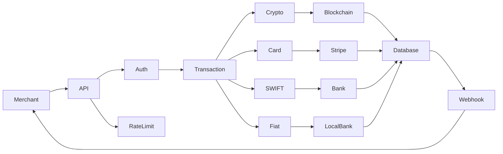
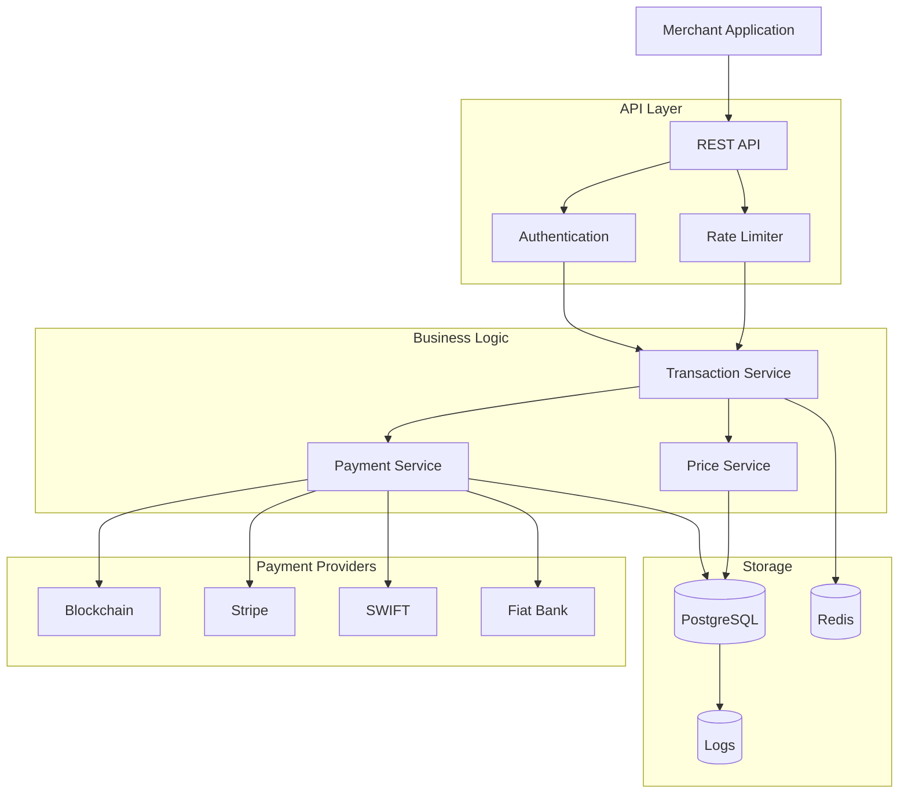
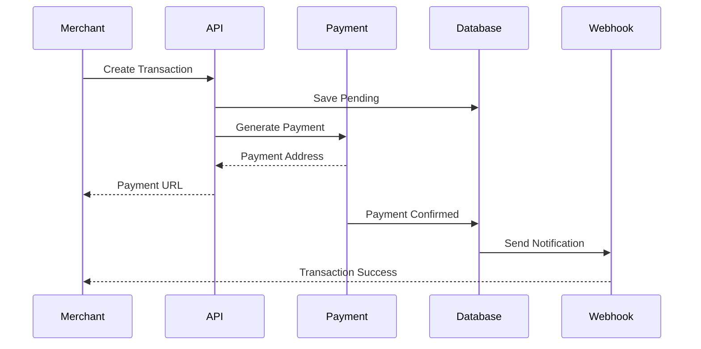
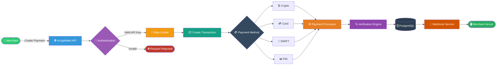

<p align="center">

</p>

<p align="center">

---

<div align="center">

# 💳 KONGALI1720 Payment Gateway API 💳

### Secure • Fast • Multi-Payment • Merchant Ready

<p align="center">

</p>

<p align="center">


</p>

<p align="center">


</p>

---

### Modern Payment Gateway Backend for Crypto, Card, Bank Transfer & Fiat Payments

</div>

---

# 📦 Features

- 🔐 HMAC Authentication
- ⚡ RESTful API
- 💳 Card Payment
- ₿ Crypto Payment
- 🏦 SWIFT Bank Transfer
- 💵 Fiat Payment
- 📡 Webhook Notification
- 🔄 Transaction Monitoring
- 📈 Live Crypto Price
- 🚀 Redis Cache
- 🛡 Rate Limiting
- 📜 Merchant Management
- 📊 Dashboard
- 📝 Transaction Logging

---

# 🏗 Project Structure

```text
/opt/kongwallet-api/
├── run.py
├── requirements.txt
├── config/
│   ├── __init__.py
│   └── settings.py
├── api/
│   ├── __init__.py
│   ├── extensions.py
│   ├── middleware/
│   │   ├── auth.py
│   │   └── rate_limit.py
│   ├── models/
│   │   ├── transaction.py
│   │   ├── merchant.py
│   │   └── webhook_log.py
│   ├── routes/
│   │   ├── transactions.py
│   │   ├── crypto.py
│   │   └── webhooks.py
│   └── services/
│       ├── crypto/
│       ├── card/
│       ├── swift/
│       ├── fiat/
│       └── price/
├── dashboard/
├── logs/
├── .env
└── kongwallet.service
```







## Project Tree
```text
kongwallet-api/
│
├── api/
│   ├── middleware/
│   ├── models/
│   ├── routes/
│   └── services/
│
├── config/
├── dashboard/
├── logs/
├── requirements.txt
├── run.py
└── kongwallet.service
```

## Server Preparations

```bash
# Create Project Directory
mkdir -p /opt/kongwallet-api
cd /opt/kongwallet-api

# Create Application Structure
mkdir -p api/routes api/models api/middleware api/services/crypto
mkdir -p api/services/card api/services/swift api/services/fiat
mkdir -p api/services/price dashboard/static/img dashboard/templates
mkdir -p config logs
```

---

# 💳 Supported Payment

| Method | Status |
|---------|--------|
| Crypto | ✅ |
| Visa / Mastercard | ✅ |
| SWIFT Transfer | ✅ |
| Fiat | ✅ |
| Merchant API | ✅ |
| Webhook | ✅ |

---

# 🔐 Security

- HMAC SHA256 Authentication
- API Key Verification
- Rate Limiter
- Redis Session
- Secure Webhook
- Request Signature
- Environment Variables
- HTTPS Ready

---

# ⚙ Technology Stack

- Python
- Flask
- PostgreSQL
- Redis
- SQLAlchemy
- Gunicorn
- Nginx
- Linux
- Docker

---

# 🚀 Installation

```bash
sudo apt update

sudo apt install -y \
python3.11 \
python3.11-venv \
python3-pip \
nginx \
certbot \
python3-certbot-nginx \
postgresql \
postgresql-contrib \
redis-server
```

```bash
git clone https://github.com/kongali1720/kongwallet-api.git

cd kongwallet-api

python3 -m venv venv

source venv/bin/activate

pip install -r requirements.txt
```

## Python3 Environment 

```bash
cd /opt/kongwallet-api

python3.11 -m venv venv

source venv/bin/activate

pip install --upgrade pip

pip install flask
pip install flask-sqlalchemy
pip install flask-cors
pip install flask-limiter

pip install psycopg2-binary
pip install redis
pip install requests
pip install python-dotenv

pip install gunicorn
pip install stripe
pip install cryptography
```

Run

```bash
python run.py
```

---

# 📡 API Modules

```
Transactions API
Crypto API
Card API
SWIFT API
Fiat API
Merchant API
Webhook API
Price API
```

## Road Map

```mermaid
timeline

title KongWallet Roadmap

2026 Q3

: REST API

: Merchant Dashboard

: Webhook

2026 Q4

: Crypto Wallet

: Stripe

: SWIFT

2027

: Multi-chain

: Admin Panel

: API Analytics

: Kubernetes Support
````

```mermaid
timeline
title KongWallet Development Roadmap

2026 Q3
: Core API
: Merchant API
: PostgreSQL
: Redis

2026 Q4
: Stripe Integration
: Crypto Wallet
: Webhook Engine

2027 Q1
: Admin Dashboard
: Analytics
: Multi-chain

2027 Q2
: Multi Currency
: Kubernetes
: High Availability
```

---
# 📊 Payment Flow

<p align="center">

</p>

---

# 📊 Payment Processing Flow

The following diagram illustrates the complete lifecycle of a payment transaction within the KongWallet Payment Gateway ecosystem. Every request passes through authentication, payment processing, verification, persistent storage, and webhook delivery before reaching the merchant application.



# 📄 License

MIT License

---

<div align="center">

Made with ❤️ by **KongWallet**

</div>

<div align="center">


# ☕ Support Development


Jika project ini membantu kamu,
support kecil sangat berarti.


<a href="https://www.paypal.com/paypalme/bungtempong99/">


</a>


</div>
